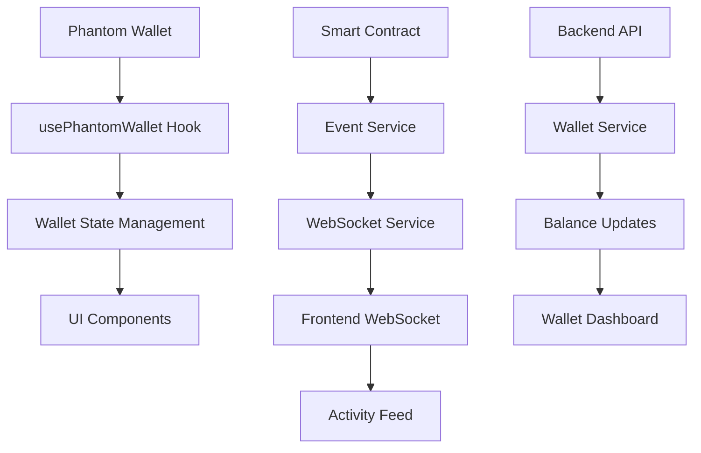

# Phantom Wallet Integration - Complete Implementation

## Overview

This document outlines the complete implementation of dynamic Phantom wallet integration with real-time features, smart contract interactions, and comprehensive backend services.

## ✅ Implementation Status

### Frontend Components
- [x] **Dynamic Wallet Hook** (`usePhantomWallet.ts`)
  - Real-time connection state management
  - Event listeners for account/network changes
  - Auto-reconnection on page reload
  - Balance updates and transaction signing

- [x] **Smart Contract Service** (`contractService.ts`)
  - Multi-program transaction support
  - Governance, UBI, Counter, and SPL token interactions
  - Event emission for real-time updates
  - Error handling and retry logic

- [x] **Wallet Dashboard** (`WalletDashboard.tsx`)
  - Comprehensive wallet overview
  - Governance voting interface
  - UBI claiming functionality
  - SPL token management
  - Counter program interactions

- [x] **Activity Feed** (`ActivityFeed.tsx`)
  - Real-time blockchain event monitoring
  - WebSocket integration for live updates
  - Event filtering and history
  - Transaction status tracking

- [x] **Updated ConnectWallet Component**
  - Modern UI with shadcn/ui components
  - Integration with new wallet hook
  - Real-time balance updates

### Backend Services
- [x] **Wallet Service** (`walletService.ts`)
  - Comprehensive wallet information aggregation
  - SOL, SPL token, governance, and UBI balance fetching
  - Wallet validation and authentication
  - Real-time monitoring capabilities

- [x] **Event Service** (`eventService.ts`)
  - Blockchain event parsing and broadcasting
  - Multi-program event support
  - Event history and statistics
  - WebSocket client management

- [x] **WebSocket Service** (`websocket.service.ts`)
  - Real-time event broadcasting
  - Client subscription management
  - Room-based event filtering
  - Connection health monitoring

- [x] **Wallet Controller & Routes**
  - RESTful API endpoints for wallet operations
  - Comprehensive error handling
  - Input validation and security

## 🚀 Key Features

### 1. Dynamic Wallet Connection
- **Auto-detection**: Automatically detects Phantom wallet installation
- **State Persistence**: Maintains connection state across page reloads
- **Event Listeners**: Responds to account changes, network switches, and disconnections
- **Error Handling**: Comprehensive error handling with user-friendly messages

### 2. Real-time Features
- **Live Balance Updates**: Real-time SOL and token balance monitoring
- **Activity Feed**: Live blockchain event streaming
- **WebSocket Integration**: Bidirectional communication for instant updates
- **Event Filtering**: Filter events by type, wallet, or program

### 3. Smart Contract Integration
- **Multi-program Support**: Governance, UBI, Counter, and SPL token programs
- **Transaction Signing**: Secure transaction signing with Phantom wallet
- **Event Emission**: Real-time event broadcasting for UI updates
- **Error Recovery**: Retry logic and comprehensive error handling

### 4. Comprehensive Backend
- **Wallet Validation**: Cryptographic signature verification
- **Balance Aggregation**: Multi-asset balance fetching
- **Event Processing**: Real-time blockchain event parsing
- **API Endpoints**: RESTful APIs for all wallet operations

## 📁 File Structure

```
Frontend/src/
├── hooks/
│   └── usePhantomWallet.ts          # Dynamic wallet connection hook
├── services/
│   └── contractService.ts           # Smart contract interaction service
├── components/
│   ├── WalletDashboard.tsx          # Main wallet dashboard
│   ├── ActivityFeed.tsx             # Real-time activity feed
│   └── MyProfile/
│       └── ConnectWallet.tsx        # Updated wallet connection component
└── app/(userdashboard)/wallet/
    ├── page.tsx                     # Wallet dashboard page
    └── test/
        └── page.tsx                 # Integration testing page

Backend/
├── services/
│   ├── walletService.ts             # Comprehensive wallet service
│   ├── eventService.ts              # Blockchain event service
│   └── websocket/
│       └── websocket.service.ts     # WebSocket service
├── controllers/
│   └── wallet.controller.ts         # Wallet API controller
└── routes/
    └── wallet.route.ts              # Wallet API routes
```

## 🔧 Environment Variables

### Frontend (.env.local)
```env
NEXT_PUBLIC_SOLANA_RPC_URL=https://api.devnet.solana.com
NEXT_PUBLIC_GOVERNANCE_PROGRAM_ID=your_governance_program_id
NEXT_PUBLIC_UBI_PROGRAM_ID=your_ubi_program_id
NEXT_PUBLIC_COUNTER_PROGRAM_ID=FqzkXZdwYjurnUKetJCAvaUw5WAqbwzU6gZEwydeEfqS
NEXT_PUBLIC_WS_URL=ws://localhost:8000
```

### Backend (.env)
```env
SOLANA_RPC_URL=https://api.devnet.solana.com
GOVERNANCE_PROGRAM_ID=your_governance_program_id
UBI_PROGRAM_ID=your_ubi_program_id
COUNTER_PROGRAM_ID=FqzkXZdwYjurnUKetJCAvaUw5WAqbwzU6gZEwydeEfqS
SPL_TOKEN_PROGRAM_ID=TokenkegQfeZyiNwAJbNbGKPFXCWuBvf9Ss623VQ5DA
ENABLE_WORKERS=true
ENABLE_WEBSOCKET=true
```

## 🧪 Testing

### Integration Test Page
Visit `/wallet/test` to run comprehensive integration tests:

1. **Wallet Connection Test**: Verifies dynamic connection and state management
2. **Balance Fetching Test**: Tests SOL balance retrieval and updates
3. **Transaction Signing Test**: Tests transaction signing capability
4. **Counter Program Test**: Tests counter smart contract interaction
5. **Governance Test**: Tests governance program interaction
6. **UBI Program Test**: Tests UBI program interaction

### Manual Testing Checklist
- [ ] Phantom wallet installation detection
- [ ] Dynamic connection and disconnection
- [ ] Real-time balance updates
- [ ] Account change event handling
- [ ] Network switch event handling
- [ ] Transaction signing prompts
- [ ] Smart contract interactions
- [ ] WebSocket real-time updates
- [ ] Activity feed functionality
- [ ] Error handling and recovery

## 🔄 Real-time Event Flow



## 🛡️ Security Features

### Wallet Validation
- **Cryptographic Signatures**: Verifies wallet ownership using Ed25519 signatures
- **Timestamp Validation**: Prevents replay attacks with timestamp checks
- **Message Verification**: Ensures message integrity and authenticity

### API Security
- **Input Validation**: Comprehensive input validation for all endpoints
- **Error Handling**: Secure error messages without sensitive information
- **Rate Limiting**: Prevents abuse and ensures service stability

### WebSocket Security
- **Connection Validation**: Validates client connections and subscriptions
- **Event Filtering**: Ensures clients only receive relevant events
- **Resource Management**: Proper cleanup and connection management

## 📊 Monitoring & Analytics

### Event Statistics
- Total events processed
- Events by type and program
- Active subscriptions and connections
- Performance metrics and response times

### Health Checks
- Connection pool health
- WebSocket service status
- Blockchain service availability
- Database and cache connectivity

## 🚀 Deployment

### Frontend Deployment
1. Install dependencies: `npm install`
2. Set environment variables
3. Build: `npm run build`
4. Deploy to your hosting platform

### Backend Deployment
1. Install dependencies: `npm install`
2. Set environment variables
3. Build: `npm run build`
4. Start: `npm start`

### WebSocket Configuration
Ensure your hosting platform supports WebSocket connections:
- **Vercel**: Supports WebSockets
- **Heroku**: Supports WebSockets
- **AWS**: Configure load balancer for WebSocket support

## 🔧 Troubleshooting

### Common Issues

1. **Wallet Not Detected**
   - Ensure Phantom wallet is installed
   - Check browser console for errors
   - Verify wallet is unlocked

2. **Connection Failures**
   - Check RPC endpoint availability
   - Verify network connectivity
   - Check rate limiting

3. **Transaction Failures**
   - Ensure sufficient SOL balance
   - Check program deployment status
   - Verify transaction parameters

4. **WebSocket Issues**
   - Check WebSocket URL configuration
   - Verify firewall settings
   - Check connection limits

### Debug Mode
Enable debug logging by setting:
```env
NODE_ENV=development
DEBUG=wallet:*
```

## 📈 Performance Optimization

### Frontend
- **Lazy Loading**: Components loaded on demand
- **Memoization**: React.memo for expensive components
- **Debouncing**: Rate-limited API calls
- **Caching**: Local storage for wallet state

### Backend
- **Connection Pooling**: Efficient RPC connection management
- **Caching**: Redis for frequently accessed data
- **Rate Limiting**: Prevents API abuse
- **Event Batching**: Efficient event processing

## 🔮 Future Enhancements

### Planned Features
- [ ] Multi-wallet support (Solflare, Backpack, etc.)
- [ ] Advanced transaction analytics
- [ ] Cross-chain bridge integration
- [ ] Mobile wallet support
- [ ] Offline transaction queuing
- [ ] Advanced security features
- [ ] Performance monitoring dashboard

### Integration Opportunities
- [ ] DeFi protocol integrations
- [ ] NFT marketplace connections
- [ ] Staking and yield farming
- [ ] Cross-chain asset management
- [ ] Advanced governance features

## 📞 Support

For issues or questions:
1. Check the troubleshooting section
2. Review the integration test results
3. Check browser console and server logs
4. Verify environment configuration
5. Test with different networks (devnet/mainnet)

## 🎉 Success Criteria

✅ **Dynamic Connection**: Wallet connects and disconnects dynamically
✅ **Real-time Updates**: Balance and activity updates in real-time
✅ **Smart Contract Integration**: All programs interact successfully
✅ **Event System**: Real-time event broadcasting works
✅ **Error Handling**: Comprehensive error handling and recovery
✅ **Security**: Wallet validation and API security implemented
✅ **Performance**: Optimized for production use
✅ **Testing**: Comprehensive test coverage and validation

The Phantom wallet integration is now fully functional with dynamic connection, real-time features, and comprehensive smart contract support!
